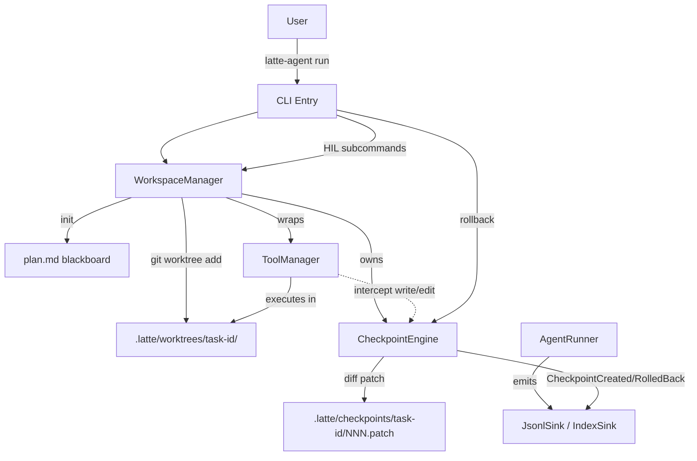

# latte-agent Blackboard + Worktree Sandbox

**Date:** 2026-06-27
**Status:** Draft (post-brainstorming, pre-implementation)
**Scope:** WorkspaceManager (Worktree lifecycle + write interception + archive) + CheckpointEngine (diff-based + git fast-shutter) + minimal HIL CLI surface.
**Out of scope (deferred to v2 spec):** SessionManager state machine, Supervisor auto-cutoff, `ask_human` tool, worktree-in-worktree nesting, PR automation, semantic blackboard (pub/sub messaging).

## 1. Background

`latte-agent` already has solid primitives at `ac8c57b`:

- Multi-role Chat / Discuss / Workflow via clap subcommands
- `TraceEvent` 9-variant observability pipeline (`NullSink` / `StdoutSink` / `JsonlSink` / `IndexSink` / `FanoutSink` / `ScopedSink` / `FilterSink`)
- 5-point `HookChain` with `HookOutcome::Retry { correction }` reserved (per `docs/superpowers/specs/2026-06-25-latte-agent-debug-observability-design.md` §3 and README §Roadmap)
- `LoopDetector` for tool-call loops
- Built-in hooks: `RedactPii`, `EnforceToolAllowlist`, `RequireToolCall`

Three production failure modes are not addressed by the current code:

1. **Main-branch contamination.** During `latte-agent discuss`, multiple specialists write to the working tree directly. One misstep requires a manual `git reset`; there is no automatic quarantine.
2. **Rollback granularity is one round.** Trace events let us *see* each step, but recovery is "throw the whole turn away" — there is no way to surgically undo a single function edit while keeping the review notes that surrounded it.
3. **Human-in-the-loop is dumb.** Correcting the agent means Ctrl-C, hand-editing files, restarting. There is no role-targeted message injection, no checkpoint browser, no per-step rollback.

This spec introduces two new modules — `WorkspaceManager` and `CheckpointEngine` — and a thin HIL CLI surface on top of them. It deliberately does **not** implement the full distributed state machine; that is a separate spec.

## 2. Goals

1. **Worktree physical isolation.** Every `latte-agent run --task-id X` creates a git worktree at `<repo>/.latte/worktrees/X/` on a local branch `latte/X`. The main branch HEAD stays clean for the entire run.
2. **ToolManager write interception.** A wrapper around `ToolManager::execute` captures every `write` / `edit` call (and, opt-in, `bash` writes flagged with a `write_bash` mode marker). On completion, the workspace commits the change in the worktree and creates a `Checkpoint` whose diff lives at `.latte/checkpoints/<task>/<id>.patch`.
3. **Per-checkpoint rollback.** `latte-agent checkpoint rollback --id N [--mode code|trace|full]`. Three modes:
   - `code`: `git reset --hard <commit>` in the worktree; trace file untouched.
   - `trace`: same reset + truncate the trace JSONL past the checkpoint's `trace_event_index`.
   - `full`: both (default).
4. **HIL CLI subcommand set.** `run`, `inject`, `pause`, `resume`, `checkpoint create`, `checkpoint list`, `checkpoint rollback`, and a new flag `--archive[--cleanup]` on `run`.
5. **Zero regression.** `chat`, `discuss`, `workflow`, `list`, `config`, `debug` keep their current behavior. The new `run` command is opt-in; no `--worktree` global flag is added to existing commands.
6. **Trace integration.** New `TraceEvent` variants `CheckpointCreated` and `CheckpointRolledBack` flow through the existing `JsonlSink` / `IndexSink` chain. Reuses `ScopedSink` for specialist-tagged events.
7. **Tested end-to-end.** Unit tests for `WorkspaceManager` (create / archive / cleanup / failure paths), `CheckpointEngine` (intercept / diff / rollback in all three modes), and HIL CLI subcommands (happy + error paths per subcommand). One black-box integration test: spawn `latte-agent run` for a 2-checkpoint synthetic task, then `rollback --id 1 --mode full`, assert the worktree matches the post-Checkpoint-0 state.

## 3. Non-Goals (deferred to v2 spec)

- **SessionManager state machine.** Cross-process / cross-worktree pause-resume. The `run` flow in this spec is a single-process, head-to-tail run. We still emit `SessionStart` / `SessionEnd` `TraceEvent`s with a stable `session_id` (= `task_id`) so v2 can index historical runs without a schema migration.
- **Supervisor auto-cutoff.** Token-budget watchdog, dead-loop detection at the session level (note: `LoopDetector` in `agent.rs` is tool-loop only, not session-loop). v2 spec.
- **`ask_human` tool.** Agent-initiated suspension + push notification to a human channel + answer injection. v2 spec.
- **Nested worktrees.** One worktree per run, period.
- **Remote push / PR creation.** Archive ends at `--no-ff` merge into the main branch. PR automation is its own spec.
- **Semantic blackboard.** The "blackboard" in this spec is a literal `plan.md` file. HIL injection is a textual patch appended to it (or, with `--role`, redirected to the specialist's prompt). Pub/sub is v2.

## 4. Architecture and Data Model

### 4.1 Top-level architecture



### 4.2 Crate topology

No new crates. Changes land in:

- `latte-agent-core/src/workspace.rs` (new): `WorkspaceManager`, `WorktreeSpec`, `WorkspaceState`, `MergeMode`
- `latte-agent-core/src/checkpoint.rs` (new): `CheckpointEngine`, `Checkpoint`, `CheckpointTrigger`, `DiffSummary`, `RollbackMode`
- `latte-agent-core/src/trace.rs` (extend): add `CheckpointCreated` and `CheckpointRolledBack` variants to `TraceEvent`
- `latte-agent-cli/src/commands/run.rs` (new): `RunCmd` with subcommand-level flags including `--archive` / `--archive --cleanup`
- `latte-agent-cli/src/commands/inject.rs` (new): `InjectCmd`
- `latte-agent-cli/src/commands/pause.rs` (new): `PauseCmd`
- `latte-agent-cli/src/commands/resume.rs` (new): `ResumeCmd`
- `latte-agent-cli/src/commands/checkpoint.rs` (new): `CheckpointCmd` with subcommands `create` / `list` / `rollback`
- `latte-agent-cli/src/main.rs` (extend): add 5 variants to the clap `Command` enum (Run, Inject, Pause, Resume, Checkpoint)

Rationale for not adding a crate: this spec's APIs are `pub` to the CLI only; the `latte-agent-orchestrator` crate does not consume `WorkspaceManager` in v1 (that is v2). Keeping the change surface small aids review.

### 4.3 WorkspaceManager types

```rust
pub struct WorktreeSpec {
    pub task_id: String,                    // "fix-redis-bug"
    pub base_branch: String,                // current HEAD's branch, resolved at start
    pub worktree_root: PathBuf,             // <repo>/.latte/worktrees/<task_id>
    pub branch_name: String,                // "latte/<task_id>" (local-only)
    pub blackboard_path: PathBuf,           // <worktree_root>/plan.md
}

pub struct WorkspaceManager {
    spec: WorktreeSpec,
    repo_root: PathBuf,                     // git rev-parse --show-toplevel
    blackboard: Blackboard,                 // thin wrapper around the plan.md file
    checkpoint_engine: Arc<CheckpointEngine>,
    state: WorkspaceState,
}

pub enum WorkspaceState {
    Created,
    Running { active_checkpoint_id: u32 },
    Archiving,
    Archived { merge_commit: String },
    Failed { reason: String },
}

pub enum MergeMode {
    NoFf,         // git merge --no-ff   (default)
    Squash,       // git merge --squash
    FastForward,  // git merge --ff-only (fails if not a strict fast-forward)
}
```

### 4.4 CheckpointEngine types

```rust
pub struct Checkpoint {
    pub id: u32,                            // monotonically increasing, starts at 0
    pub task_id: String,
    pub git_commit: String,                 // commit SHA inside the worktree
    pub created_at: String,                 // ISO8601 UTC
    pub trigger: CheckpointTrigger,
    pub diff_summary: DiffSummary,          // { files_changed, insertions, deletions }
    pub diff_path: PathBuf,                 // .latte/checkpoints/<task>/<id>.patch
    pub trace_event_index: u64,             // byte offset into ~/.latte/traces/<task>.jsonl
}

pub enum CheckpointTrigger {
    ToolWrite { tool: String, args_hash: String },
    Explicit,                               // CLI: latte-agent run --checkpoint
    PreHazard,                              // captured before a known-risky operation
}

pub struct DiffSummary {
    pub files_changed: usize,
    pub insertions: usize,
    pub deletions: usize,
}

pub struct CheckpointEngine {
    worktree_root: PathBuf,
    storage_dir: PathBuf,                   // .latte/checkpoints/<task_id>/
    next_id: u32,                           // resumes from max(existing ids)
    sink: Arc<dyn TraceSink>,
    write_tools: HashSet<String>,           // default {"write", "edit"}
    enable_bash_capture: bool,              // default false
}

pub enum RollbackMode {
    Code,    // git reset --hard <commit>; trace untouched
    Trace,   // same reset + truncate JSONL past trace_event_index
    Full,    // Code + Trace (default)
}
```

### 4.5 New TraceEvent variants

```rust
pub enum TraceEvent {
    // ... existing 9 variants ...

    CheckpointCreated {
        meta: TraceMeta,
        checkpoint_id: u32,
        git_commit: String,
        trigger_kind: String,        // "tool_write" | "explicit" | "pre_hazard"
        diff_summary: DiffSummary,
    },
    CheckpointRolledBack {
        meta: TraceMeta,
        checkpoint_id: u32,
        mode: String,                // "code" | "trace" | "full"
        rolled_back_to: String,      // git_commit
    },
}
```

`TraceMeta` does not carry a `task_id` field — it carries `session_id`. We reuse `session_id` to hold the `task_id` (1:1 in this spec), so v2 can swap in a real session UUID without a JSONL migration. Documented in §6.5.

## 5. WorkspaceManager Lifecycle

```
[Created]      -- start()       --> [Running]
[Running]      -- checkpoint()  --> [Running]  (new Checkpoint recorded)
[Running]      -- archive()     --> [Archiving]  (--no-ff merge into base_branch)
[Archiving]    -- merge ok      --> [Archived]   (worktree + branch kept until cleanup())
[Archiving]    -- merge fails   --> [Failed]     (worktree preserved, surface error to user)
[Archived]     -- cleanup()     --> (worktree dir removed, branch deleted, base merged)
[Failed]       -- cleanup()     --> (worktree + branch preserved, awaiting human decision)
```

Invariants:

- `Created → Running` always creates Checkpoint `id=0` recording the "worktree clean" state. Its diff is empty.
- `Running` state always knows the latest `active_checkpoint_id`.
- If `archive()` finds uncommitted changes in the worktree (e.g. a write slipped past interception), it runs `git add -A && git commit -m "[auto-commit-pre-archive]"` first. The commit message prefix is grep-friendly in trace.
- `cleanup()` is best-effort: it never panics; it logs and continues if removal of the worktree directory or branch deletion fails.
- `WorkspaceManager` is `Send + Sync` via internal `parking_lot::Mutex` (matches the existing convention in `latte-agent-core`).

### 5.1 Filesystem layout

```
<repo_root>/
├── .latte/
│   ├── worktrees/
│   │   └── fix-redis-bug/                # actual worktree
│   │       ├── .git                      # gitfile pointing to .git/worktrees/fix-redis-bug
│   │       ├── plan.md                   # WorktreeSpec.blackboard_path
│   │       └── ...project files...       # what the agent edits
│   ├── checkpoints/
│   │   └── fix-redis-bug/
│   │       ├── 0000.patch                # empty diff (clean baseline)
│   │       ├── 0001.patch                # first intercepted write
│   │       └── manifest.json             # [{id, git_commit, created_at, trigger, ...}]
│   └── sessions/
│       └── fix-redis-bug.idx             # IndexSink metadata (existing)
├── .git/
│   └── worktrees/
│       └── fix-redis-bug/                # git's own worktree metadata
└── ...(main branch untouched)...
```

### 5.2 Command-line interface

```bash
# Start an isolated task
latte-agent run \
  --task-id fix-redis-bug \
  --roles manager,programmer,reviewer \
  --initial-prompt "Redis pool doesn't recycle after 5xx" \
  [--checkpoint-mode auto|explicit]      # auto=intercept write/edit; explicit=manual only
  [--no-blackboard]                       # skip plan.md creation (rare)

# Inject during a run (HIL role-targeted message)
latte-agent inject --task-id fix-redis-bug \
  --role programmer \
  --message "Ignore formatting; focus on the lock logic"

# Pause / resume (v1: cooperative — sets a flag, agent checks at HookPoint boundaries)
latte-agent pause  --task-id fix-redis-bug
latte-agent resume --task-id fix-redis-bug

# Checkpoint management
latte-agent checkpoint list    --task-id fix-redis-bug
latte-agent checkpoint rollback --task-id fix-redis-bug --id 3 [--mode code|trace|full]

# Archive (merge + optional cleanup)
latte-agent run --task-id fix-redis-bug --archive            # archive() only
latte-agent run --task-id fix-redis-bug --archive --cleanup  # archive() + cleanup()
```

### 5.3 Backward compatibility

- `latte-agent chat` / `discuss` / `workflow` / `list` / `config` / `debug` keep current behavior. No `--worktree` global flag is added.
- Users who want the new behavior migrate explicitly to `latte-agent run`. v2 may add `--worktree` to the existing commands once the v1 semantics are battle-tested.

## 6. CheckpointEngine

### 6.1 Intercept protocol

`CheckpointEngine` exposes a single method called by the `WorkspaceManager`-wrapped `ToolManager`:

```rust
impl CheckpointEngine {
    /// Called by WorkspaceManager after a write/edit (and, when
    /// enable_bash_capture, after a bash call marked as a write).
    /// Returns the created Checkpoint.
    pub fn record_write(
        &self,
        tool: &str,
        args: &serde_json::Value,
    ) -> Result<Checkpoint, CheckpointError>;
}
```

Flow on each call:

1. `git -C <worktree_root> add -A`
2. `git -C <worktree_root> diff --cached --stat` to compute `DiffSummary`
3. `git -C <worktree_root> diff --cached` → full diff written to `<storage_dir>/<next_id>.patch`
4. `git -C <worktree_root> commit -m "checkpoint(<task_id>): <tool> <args-hash>"`
5. Capture the resulting commit SHA and the current byte offset of `~/.latte/traces/<task_id>.jsonl`
6. Persist a `manifest.json` line for this checkpoint
7. Emit `TraceEvent::CheckpointCreated`
8. Update `next_id`

If any step fails, the write is **not** rolled back; we record a `CheckpointError` and the caller decides. (Rationale: silently rolling back a tool call would be worse than the partial checkpoint — the worktree remains the source of truth.)

### 6.2 Explicit checkpoints

An explicit checkpoint is triggered by `latte-agent checkpoint create --task-id X` (a subcommand of `checkpoint`, alongside `list` / `rollback`). It calls `record_write(tool="explicit", args={})` immediately, capturing the worktree's current dirty-but-uncommitted state as a checkpoint. The `run` subcommand does not take a `--checkpoint` flag — explicit checkpoints are always out-of-band, so they can fire against a live run from another terminal.

### 6.3 PreHazard checkpoints

A built-in checkpoint hook fires `record_write(tool="pre_hazard", args={})` immediately before any of:

- `git push` (deferred to v2 — no remote push in v1)
- `rm -rf` in bash (when `enable_bash_capture` is on)
- Any other future operation flagged in `pre_hazard_tools: HashSet<String>`

The set defaults to empty in v1 and is configurable via `config/checkpoints.toml` (TOML format mirrors `agents.toml`).

### 6.4 Rollback protocol

`latte-agent checkpoint rollback --id N --mode M`:

1. Load `manifest.json`, look up `git_commit` for id `N`
2. **Code / Full**: `git -C <worktree_root> reset --hard <git_commit>`
3. **Trace / Full**: open `~/.latte/traces/<task_id>.jsonl` in append mode, truncate to byte offset `trace_event_index` recorded at checkpoint time. (`IndexSink`'s session file is *not* truncated; it is metadata-only and can stay as a session summary. We will document this trade-off.)
4. Emit `TraceEvent::CheckpointRolledBack`
5. Update `WorkspaceManager` to `WorkspaceState::Running { active_checkpoint_id: N }`

Failure modes:

- `id N` not found → exit code 64 (EX_USAGE), stderr: `checkpoint N not found in <task_id>`
- `git reset` fails (dirty worktree) → exit code 73 (EX_CANTCREAT), stderr with the git output
- Trace truncation fails → exit code 75 (EX_TEMPFAIL), worktree already reset; the user is told to manually truncate

### 6.5 session_id == task_id

`TraceMeta::session_id` is set to `task_id` for every event in a `run`. Justification: in v1, one task = one session; v2's `SessionManager` will mint a real session UUID at the top of the run and we can swap it in without touching the on-disk JSONL schema.

## 7. HIL CLI Protocol

### 7.1 `run`

Drives a full task lifecycle:

1. Resolve `task_id` (must be unique among active runs; error if duplicate)
2. `WorkspaceManager::create()` → `WorkspaceState::Created`
3. Initialize `plan.md` from `--initial-prompt` and the role list (format: H2 sections per role, initial-prompt as the first user-role line)
4. Emit `SessionStart` `TraceEvent` with `session_id = task_id`, tier, model chain
5. Loop over `AgentRunner` for each `--roles` in declared order, until consensus (manager decides v1: simple round-robin + 3 rounds, matches `DiscussConfig::NoConsensus` style; v2 will reuse `DiscussionOrchestrator`)
6. On exit: if `--archive` is set, `archive()` then `cleanup()` if `--cleanup` is set
7. Emit `SessionEnd` `TraceEvent` with totals

### 7.2 `inject`

Appends a message to either the blackboard file or the next user-role message of the named role's prompt. Routing rules:

- `--role X --message M` with no `--to-blackboard`: appends `M` to `X`'s pending user-prompt queue. The next `AgentRunner::run_turn` for `X` consumes it.
- `--message M` with no `--role`: appends `M` to `plan.md` as a new `## HUMAN @ <UTC>` section.

In v1, the "pending user-prompt queue" is a simple file: `<worktree_root>/.latte/inject/<role>.txt`. The agent runner reads it before each turn. v2 will replace with a real message bus.

### 7.3 `pause` / `resume`

Cooperative. Sets a flag in `<worktree_root>/.latte/control/paused` (a regular file, presence = paused). The `AgentRunner` checks at the start of every `run_turn` and exits cleanly if paused; `resume` removes the file. A `paused` exit is **not** a failure — exit code 0, and `SessionEnd` is emitted with `total_turns` reflecting the work done so far. The user can `latte-agent run --task-id X` to restart from the last checkpoint (in v1, restart = re-enter the run loop with the existing `plan.md`).

## 8. Testing

### 8.1 Unit tests

| Target | Test | What it asserts |
|---|---|---|
| `WorkspaceManager` | `create_creates_worktree_and_branch` | `git worktree list` shows the new worktree, branch is `latte/<task_id>`, plan.md exists, Checkpoint 0 is recorded |
| `WorkspaceManager` | `archive_merges_with_no_ff` | After `archive(NoFf)`, main branch HEAD has a merge commit with the worktree's commits as parents |
| `WorkspaceManager` | `archive_fails_on_conflict` | Pre-populate a conflicting change on main, run `archive`, assert state is `Failed`, worktree preserved, stderr names the conflict |
| `WorkspaceManager` | `cleanup_removes_worktree_and_branch` | After `archive + cleanup`, `git worktree list` and `git branch` no longer mention `<task_id>` |
| `CheckpointEngine` | `record_write_creates_checkpoint_and_patch` | After a write, `manifest.json` has a new entry; `<id>.patch` matches `git show <commit>`'s diff |
| `CheckpointEngine` | `record_write_emits_trace_event` | `JsonlSink` for the test sink receives a `CheckpointCreated` event with the right meta |
| `CheckpointEngine` | `rollback_code_resets_worktree` | Two writes, rollback to id=1 → worktree matches post-Checkpoint-0 state |
| `CheckpointEngine` | `rollback_trace_truncates_jsonl` | Two writes, rollback to id=1 mode=trace → `~/.latte/traces/<task>.jsonl` byte length equals the recorded `trace_event_index` of checkpoint 1 |
| `CheckpointEngine` | `rollback_full_does_both` | Both effects verified |
| `RunCmd` | `run_happy_path` | E2E with two synthetic tool calls, assert two checkpoints |
| `InjectCmd` | `inject_routes_to_role_queue` | File at `<worktree>/.latte/inject/<role>.txt` contains the message |
| `InjectCmd` | `inject_without_role_appends_to_blackboard` | `plan.md` has a new `## HUMAN @` section |
| `PauseCmd` / `ResumeCmd` | `pause_sets_flag_resume_removes` | File presence flips |
| `CheckpointCmd::create` | `create_records_explicit_checkpoint` | After `checkpoint create`, manifest has a new entry with `trigger_kind == "explicit"` |
| `CheckpointCmd::rollback` | happy + error paths | `code`, `trace`, `full`, plus `id not found` exit code 64 |
| Trace integration | `new_variants_serialize` | `CheckpointCreated` / `CheckpointRolledBack` round-trip through `serde_json` |

### 8.2 Black-box integration test

`tests/workspace_e2e.rs`:

1. `tempfile::tempdir()` for repo root
2. `git init`, `git commit --allow-empty` (initial commit on `main`)
3. Create a file `main.txt` with content `original`
4. `latte-agent run --task-id e2e --roles programmer --initial-prompt "noop" --checkpoint-mode auto` (with a fake / dev `programmer` tool that does two `write` calls)
5. Assert: 2 Checkpoints, worktree branch `latte/e2e` exists, main's `main.txt` is still `original`
6. `latte-agent checkpoint rollback --task-id e2e --id 1 --mode full`
7. Assert: worktree's file is back to `original`, JSONL truncated, `CheckpointRolledBack` event present

This test will be the gate for declaring v1 done. If it fails, v1 is not done.

### 8.3 Property-style test (light)

For `DiffSummary`, a quick `proptest` over randomly generated diffs: `files_changed == git diff --name-only | wc -l`, `insertions == git diff --shortstat`'s first number. Optional; if `proptest` is not already a dep, skip rather than add.

## 9. Implementation Phasing

One implementation plan will be written from this spec (via the `writing-plans` skill). Anticipated phases (not commitments):

1. **Phase 1 — Types & Trace variants.** Add `workspace.rs`, `checkpoint.rs`, two new `TraceEvent` variants. No behavior, just compileable types with doc-comments and `Debug`/`Clone`/`Serialize`/`Deserialize` where appropriate. Tests: serde round-trip for new variants.
2. **Phase 2 — WorkspaceManager creation.** `create()` path: `git worktree add`, branch, plan.md init, Checkpoint 0. Tests: `create_creates_worktree_and_branch`.
3. **Phase 3 — CheckpointEngine interception.** Wrap `ToolManager::execute` (or expose `record_write` to the runner). Tests: `record_write_creates_checkpoint_and_patch`, `record_write_emits_trace_event`.
4. **Phase 4 — Rollback.** `code` / `trace` / `full` paths. Tests: `rollback_*`.
5. **Phase 5 — Archive + cleanup.** `archive()` with `MergeMode` enum, `cleanup()`. Tests: `archive_merges_with_no_ff`, `archive_fails_on_conflict`, `cleanup_removes_worktree_and_branch`.
6. **Phase 6 — CLI subcommands.** `run`, `inject`, `pause`, `resume`, `checkpoint create`, `checkpoint list`, `checkpoint rollback`. Wire to clap. Tests: each subcommand's happy + error path.
7. **Phase 7 — Integration test.** `tests/workspace_e2e.rs` from §8.2.
8. **Phase 8 — Docs.** Update `README.md` with a new "Workspace + Checkpoint" section; cross-link from the "Roadmap" bullet that mentions this work as deferred.

Each phase ends with `cargo test` green and a commit. No phase is "done" until its tests pass and its spec acceptance criteria are met.

## 10. Risks and Open Questions

1. **Concurrent runs with the same `task_id`.** We detect duplicate by scanning `.latte/worktrees/<task_id>/` and reject if present. v2 may want a lock file; v1 is single-host.
2. **Long-running `bash` commands.** If a `bash` call is mid-execution and the user runs `pause`, the run continues until the bash returns. v1 is best-effort; the v2 `Supervisor` will gain a hard-kill path.
3. **Worktree on a non-git directory.** `WorkspaceManager::create` errors with a clear message and exit code 78 (EX_CONFIG). We do not fall back to a non-git sandbox.
4. **`.latte/` inside the worktree.** The worktree's own `.latte/` (checkpoints, inject queue) is committed into the worktree's branch. We add a `.gitignore` entry inside the worktree at creation time to keep `.latte/` out of the worktree's own commits. The `.latte/` of the **main** repo (sibling to the worktree) is unaffected.
5. **Large diffs.** A single Checkpoint with a multi-MB diff is stored to disk as-is. v1 does not compress; v2 may add zstd if real workloads show the need.

## 11. Acceptance Criteria (v1 done iff ALL true)

- [ ] All 9 existing CLI subcommands (`discuss`, `chat`, `workflow`, `list`, `config`, `debug`) pass their existing test suites with **zero modifications**.
- [ ] `cargo test --workspace` green; the new integration test in §8.2 passes.
- [ ] `latte-agent run --task-id X --roles programmer --initial-prompt Y` creates a worktree, runs to completion, archives with `--no-ff`, leaves main branch clean.
- [ ] `latte-agent checkpoint rollback --task-id X --id 1 --mode full` returns the worktree to the post-Checkpoint-0 state and truncates the trace JSONL.
- [ ] `latte-agent inject --task-id X --role programmer --message "..."` places the message in the role's queue; the next `run_turn` for that role picks it up.
- [ ] New `CheckpointCreated` and `CheckpointRolledBack` events appear in `~/.latte/traces/<task_id>.jsonl` and in `latte-agent debug session <id>` output.
- [ ] README updated to point at this spec and document the new subcommands.
